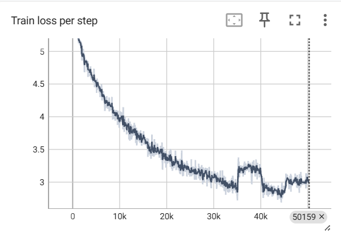

# Transformers

This reposiotry is implementation of [Attention is all you need](https://arxiv.org/abs/1706.03762) paper.

I implemented this model with the help of an excellent YouTube tutorial by [Umar Jamil](https://www.youtube.com/watch?v=ISNdQcPhsts).

I have made some changes to the [original code](https://github.com/hkproj/pytorch-transformer). For my learning purpose, I have trained a English-Hindi translation transformer model from scratch.

## Dataset

I have used [this dataset](https://huggingface.co/datasets/cfilt/iitb-english-hindi).

## Configuration

The model configuration used to train this model is available in the `config.json` file.

### Vocab

I used [sentencepiece](https://github.com/google/sentencepiece) to train a custom vocab for the model of size 10k for each language. The tokenizer models are available in the `models` directory.

If you want to train your own tokenizer, check out the `train_tokenizer.py` file. You may need to make few changes before running.

### Training

I trained the model for **10 epochs/50k steps** (~5 hours) using free [Lightning AI](https://lightning.ai/) credits on a single T4 instance. Got a BLEU score of `0.07` — which is really poor for a real-world application but decent for learning purposes.

Below is the train loss graph:

